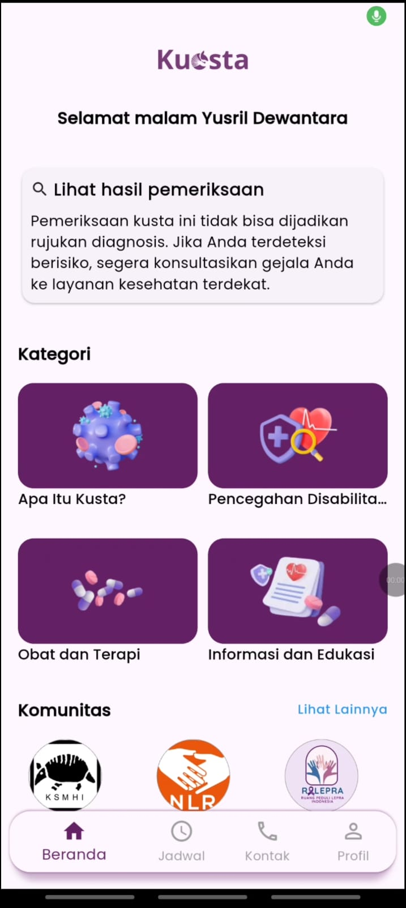
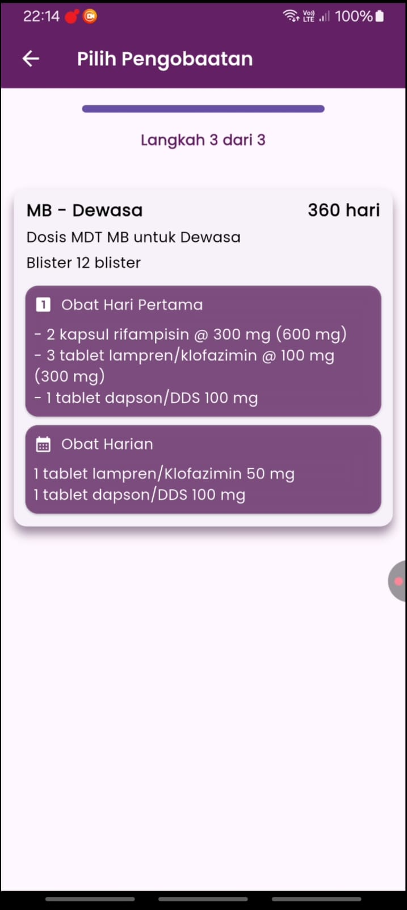
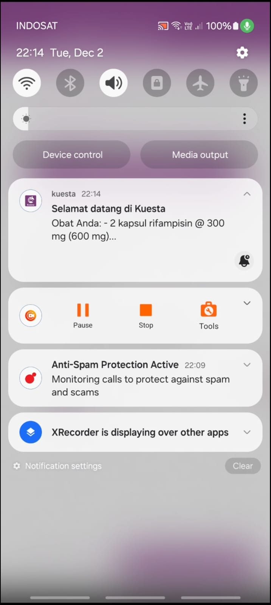

# Kuesta

## Overview

**Kuesta** adalah aplikasi mobile yang ditujukan untuk pengidap kusta, dengan fokus pada pendampingan pasien selama proses pengobatan. Aplikasi ini dirancang sebagai *support system* yang membantu deteksi dini, kepatuhan konsumsi obat, pencatatan berobat, serta penyediaan edukasi dan motivasi.

Kuesta tidak menggantikan peran tenaga medis. Seluruh fitur bersifat pendukung dan tetap merekomendasikan pemeriksaan lanjutan oleh dokter spesialis kulit dan kelamin (Sp.DVE).

---

## Objectives

- Mendukung **deteksi dini kusta** sebagai langkah awal kesadaran
- Membantu pasien menjaga **kepatuhan pengobatan jangka panjang**
- Menyediakan sarana pencatatan dan pengingat berobat
- Memberikan edukasi dan motivasi yang berkelanjutan
- Memfasilitasi akses ke komunitas pendukung

---

## Core Features

### Early Detection Support
- Screening berbasis input gejala
- Hasil bersifat indikatif (bukan diagnosis)
- Rekomendasi pemeriksaan lanjutan oleh **Sp.DVE**

### Medication Management
- Penggolongan dosis berdasarkan:
  - Usia pasien
  - Jenis kusta (**PB / MB**)
- Penjadwalan konsumsi obat jangka panjang
- **Real-time notification** untuk pengingat minum obat

### Medical Notes & Reminders
- Pencatatan aktivitas dan riwayat berobat
- Pengingat jadwal kontrol atau tindak lanjut

### Expert Motivation
- Konten motivasi dari dokter spesialis (Sp.DVE)
- Mendukung konsistensi dan kondisi mental pasien

### Educational Content
- Artikel seputar kusta untuk pasien dan keluarga

### Community Access
- Daftar komunitas pendukung
- Integrasi **WebView** ke website atau akun media sosial komunitas

---

## Screenshots

Letakkan screenshot UI aplikasi pada folder `/screenshots`.

screenshots/  
├── onboarding.png  
├── early_detection.png  
├── medication_schedule.png  
├── notification.png  
├── notes.png  
├── motivation.png  
└── community.png  

### Application Preview

| Feature             | Screenshot                                          |
|---------------------|-----------------------------------------------------|
| Onboarding          |            |
| Early Detection     |  |
| Medication Schedule |           |
| Notification        |      |
| Notes               |                      |
| Motivation          |            |
| Community           |              |

---

## Technical Stack

- **Framework**: Flutter
- **State Management**: GetX
- **Design Pattern**: Model–View–Controller (MVC)
- **Navigation & Dependency Binding**: GetX
- **Notification**: Local Notification (Scheduled & Real-time)

---

## Architecture & Design Pattern

Aplikasi ini menggunakan **Model–View–Controller (MVC)** dengan pendekatan arsitektur yang mengikuti **best practice GetX**.

Pendekatan ini memastikan:
- Pemisahan tanggung jawab yang jelas
- Pengelolaan state yang terkontrol
- Kode yang mudah dipelihara

### Layer Responsibilities
- **Model**: Representasi data dan struktur domain
- **View**: UI layer dengan widget ringan dan reusable
- **Controller**: State management dan alur logika aplikasi

---

## Project Structure

```text
lib/
├── data/
│   ├── api_service/
│   └── repository/
├── modules/
│   ├── detection/
│   ├── medication/
│   ├── notes/
│   ├── motivation/
│   ├── article/
│   └── community/
├── models/
├── controllers/
├── bindings/
├── utils/
│   ├── images/
│   ├── colors/
│   ├── widgets/
│   └── extensions/
└── main.dart
