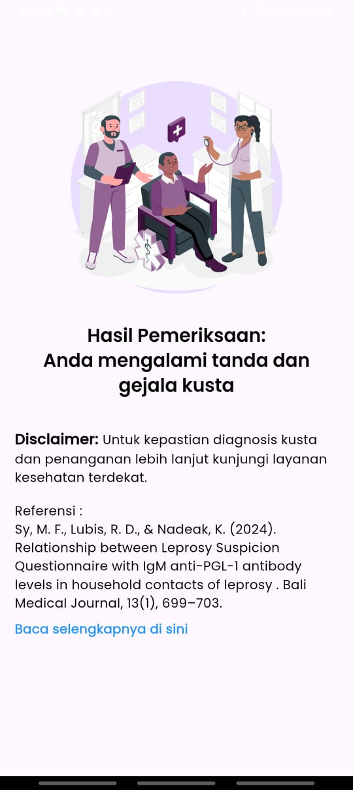
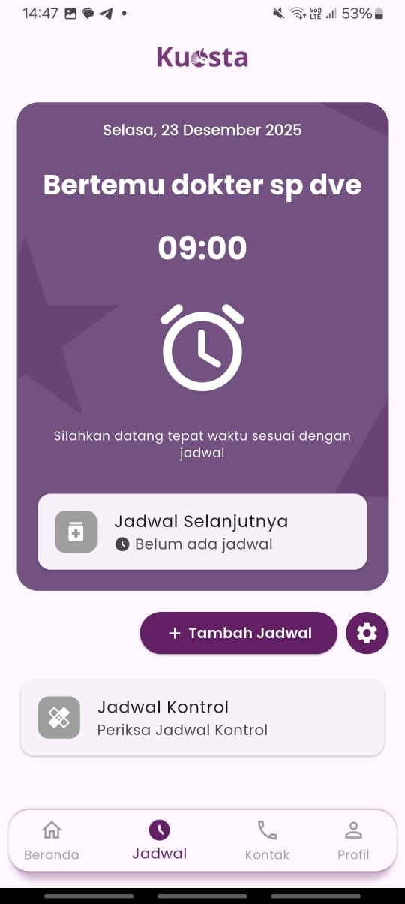
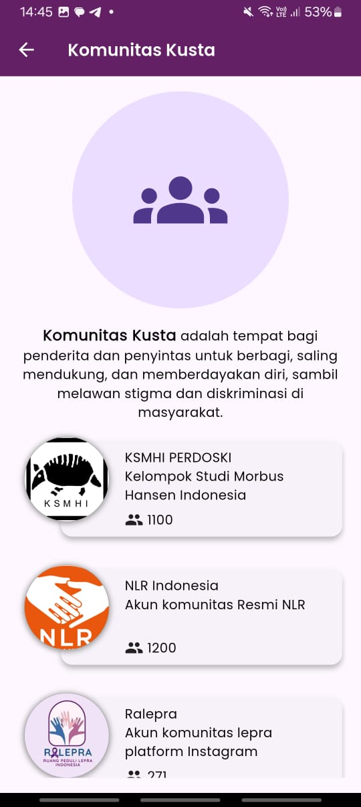

# Kuesta

## Overview

**Kuesta** is a mobile application designed for individuals affected by leprosy, with a primary focus on patient assistance throughout the treatment process. The application is built as a *support system* to aid early detection awareness, long-term medication adherence, medical record tracking, and the delivery of educational and motivational content.

Kuesta does not replace the role of medical professionals. All features are intended as supportive tools and consistently recommend further examination by a certified dermatologist and venereologist (Sp.DVE).

---

## Objectives

- Support **early awareness and detection of leprosy**
- Assist patients in maintaining **long-term treatment adherence**
- Provide tools for medical notes and treatment reminders
- Deliver continuous education and motivation
- Facilitate access to supportive communities

---

## Core Features

### Early Detection Support
- Symptom-based screening input
- Indicative results only (not a medical diagnosis)
- Recommendation for further examination by **Sp.DVE**

### Medication Management
- Dose classification based on:
  - Patient age
  - Leprosy type (**PB / MB**)
- Long-term medication scheduling
- **Real-time notifications** for medication reminders

### Medical Notes & Reminders
- Logging of medical activities and treatment history
- Reminders for follow-up visits and scheduled controls

### Expert Motivation
- Motivational content provided by certified specialists (Sp.DVE)
- Supports patient consistency and mental well-being

### Educational Content
- Articles related to leprosy for patients and their families

### Community Access
- Directory of support communities
- **WebView** integration with community websites or social media platforms

---

## Application Preview

| Feature             | Screenshot                                          |
|---------------------|-----------------------------------------------------|
| Onboarding          |            |
| Early Detection     |  |
| Medication Schedule |      |
| Notification        |      |
| Notes               |                     |
| Motivation          |             |
| Community           |             |

---

## Technical Stack

- **Framework**: Flutter
- **State Management**: GetX
- **Design Pattern**: Model–View–Controller (MVC)
- **Navigation & Dependency Binding**: GetX
- **Notification**: Local Notifications (Scheduled & Real-time), Firebase

---

## Architecture & Design Pattern

The application adopts a **Model–View–Controller (MVC)** architecture following **GetX best practices**.

This approach ensures:
- Clear separation of responsibilities
- Controlled and predictable state management
- Code that is maintainable and scalable

### Layer Responsibilities

- **Model**: Data representation and domain structures
- **View**: UI layer composed of lightweight, reusable widgets
- **Controller**: Application logic, state handling, and workflow orchestration

---

## Project Structure

```
lib/
├── data/
│   ├── api_service/
│   └── repository/
├── modules/
│   ├── detection/
│   ├── medication/
│   ├── notes/
│   ├── motivation/
│   ├── article/
│   └── community/
├── models/
├── controllers/
├── bindings/
├── utils/
│   ├── images/
│   ├── colors/
│   ├── widgets/
│   └── extensions/
└── main.dart
```

---

## Closure

Kuesta is developed with a strong emphasis on clarity, maintainability, and real-world applicability.  
The project reflects a structured engineering approach that prioritizes user support, architectural consistency, and long-term sustainability, particularly within sensitive healthcare-related domains.

This documentation represents a commitment to professional software engineering practices, focusing on clear system design, thoughtful feature planning, and maintainable code structure.
